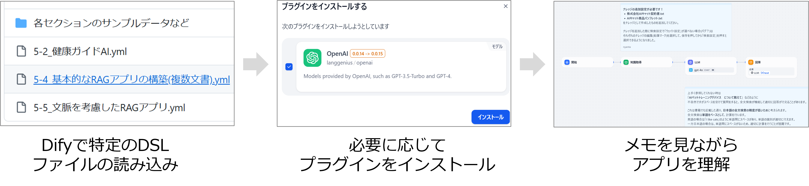
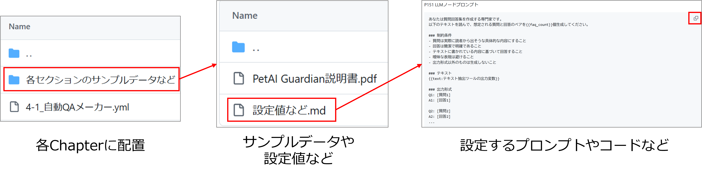

# ゼロからわかるDifyの教科書 📚 サンプルコード

## 📋 目次
- [概要](#概要)
- [ディレクトリ構成](#📁ディレクトリ構成)
- [使用方法](#🚀使用方法)
- [各章の内容](#📖各章の内容)
- [更新履歴](#📝更新履歴)
- [注意事項](#⚠️注意事項)

## 概要

このリポジトリは「[**ゼロからわかるDifyの教科書 ～生成AI×ノーコードでかんたん業務効率化**](https://www.amazon.co.jp/%E3%82%BC%E3%83%AD%E3%81%8B%E3%82%89%E3%82%8F%E3%81%8B%E3%82%8BDify%E3%81%AE%E6%95%99%E7%A7%91%E6%9B%B8-%EF%BD%9E%E7%94%9F%E6%88%90AI%C3%97%E3%83%8E%E3%83%BC%E3%82%B3%E3%83%BC%E3%83%89%E3%81%A7%E3%81%8B%E3%82%93%E3%81%9F%E3%82%93%E6%A5%AD%E5%8B%99%E5%8A%B9%E7%8E%87%E5%8C%96-%E3%81%AB%E3%82%83%E3%82%93%E3%81%9F/dp/4297148366/ref=pd_ci_mcx_mh_mcx_views_0_image?pd_rd_w=tSM9L&content-id=amzn1.sym.7133fed1-b7f0-4a9a-85e6-ec0056dbe781%3Aamzn1.symc.409c7fce-cbd2-4cf4-a6cb-824c258c8778&pf_rd_p=7133fed1-b7f0-4a9a-85e6-ec0056dbe781&pf_rd_r=H93BQDE1GRRN3PSX0008&pd_rd_wg=iFxhE&pd_rd_r=3abf0e11-7109-4f01-a488-247cb764de99&pd_rd_i=4297148366)」のDSLファイルやサンプルデータなどを提供しています。

<p align="center">
  
</p>

本書は、プログラミングスキルを持たないビジネスパーソンが、Dify（ノーコードで生成AIアプリケーションを構築できるプラットフォーム）を活用して実用的な生成AIアプリケーションを自ら開発できるようになるための実践ガイドです。このリポジトリには、書籍内で紹介されている全てのアプリケーションのYAMLファイルと、必要なデータファイルが含まれています。

---
## 📚本書の進め方
　このリポジトリには、書籍で紹介している各アプリケーションを簡単に再現できるよう、DSLファイル（.yml拡張子のファイル）を用意しています。



インポート方法の詳細については、書籍の3.1節「Difyへのアプリインポート方法」をご参照ください。


また、各chapterフォルダ内の`各セクションのサンプルデータなど`には、アプリケーション構築に必要な**設定値(プロンプトやコードなど)** やサンプルデータを格納しています。こちらも必要に応じてご利用ください。




## 📁ディレクトリ構成

本リポジトリは章ごとにディレクトリが分かれており、章によって構造が異なります。  
各ディレクトリには、その章で作成するアプリケーションのYAMLファイルとサンプルデータが含まれています。

```
├── chapter3/                 # 基本的なテキスト処理アプリ
│   ├── 3-2_営業レポートメーカー.yml
│   ├── 3-4_AI文書校正アシスタント.yml
│   ├── 3-5_マルチ文書アシスタント.yml
│   └── 各セクションのサンプルデータなど/     # サンプルデータ、設定値など
│       ├── section2/
│       ├── section4/
│       └── ...
│
├── chapter4/                 # 文書処理アプリケーション
│   ├── 4-1_自動QAメーカー.yml
│   ├── 4-2_PDF Q&Aアシスタント.yml
│   ├── 4-3_文書要約アプリ.yml
│   └── 各セクションのサンプルデータなど/     # サンプルデータ、設定値など
│       ├── section1/
│       │   ├── PetAI Guardian説明書.pdf
│       │   └── 設定値など.md
│       └── ...
│
├── chapter5/                 # RAGアプリケーション
│   ├── 5-2_健康ガイドAI.yml
│   ├── 5-4_基本的なRAGアプリの構築(複数文書).yml
│   ├── 5-5_文脈を考慮したRAGアプリ.yml
│   └── 各セクションのサンプルデータなど/     # サンプルデータ、設定値など
│       ├── section2/
│       ├── section4/
│       └── ...
│
├── chapter6/                 # 外部ツール連携
│   ├── 6-1_画像生成アプリ.yml
│   ├── 6-2_ウェブ検索アシスタント.yml
│   ├── 6-4_請求書情報記録アプリ.yml
│   └── 各セクションのサンプルデータなど/     # サンプルデータ、設定値など
│       ├── section2/
│       ├── section3/
│       │   ├── google_spread_sheet.gs
│       │   └── 請求書画像.jpg
│       └── ...
│
└── chapter7/                 # AIエージェント
    ├── 7-2_AIエージェント.yml
    └── にゃんたについて.txt
```

各章のファイル命名規則は次の通りです。
- YAMLファイル: 章番号-節番号_アプリ名.yml
- 各セクションのサンプルデータ: 該当するセクションで使用するテキスト、PDF、画像などのデータファイルと設定値の説明


## 📖各章の内容

| 章 | タイトル | 概要 | 主なアプリケーション例 |
|-----|--------|------|----------------------|
| **第3章** | 基本的なテキスト処理アプリケーション | テキスト生成の基礎となるアプリケーション | 営業レポート自動作成、文書校正支援 |
| **第4章** | 文書処理・要約アプリケーション | 長文を要約・分析するアプリケーション | PDF文書からのQ&A生成、長文要約 |
| **第5章** | RAG（検索拡張生成）を活用したアプリケーション | 独自データを活用した質問応答システム | 健康アドバイス、社内知識ベース検索 |
| **第6章** | 外部ツール連携アプリケーション | APIを使った外部システム連携 | 画像生成、ウェブ検索、スプレッドシート連携 |
| **第7章** | AIエージェントの活用 | 自律的に動作するAIエージェントの構築 | 会話型AIアシスタント |


## ⚠️注意事項

- クラウド版Difyでの動作を前提としています。コミュニティ版は個々の環境に依存するバグが発生することがあります。
- **重要**: クラウド版Difyでアプリを公開すると、そのURLを知っている誰でもアクセスできる状態になります。
- アプリを非公開にするには、アプリ設定画面の「公開設定」から「非公開」を選択してください。
- 本書で作成するアプリは学習目的のものですので、作成・確認後は非公開設定にするか削除することを推奨します。
- 機密情報を含むデータを入力する際は、セキュリティ上の問題がないか十分に確認してください。
- サンプルコードは随時更新される可能性があります。最新版は本リポジトリでご確認ください。


*このリポジトリは「ゼロからわかるDifyの教科書」の学習用素材です。*